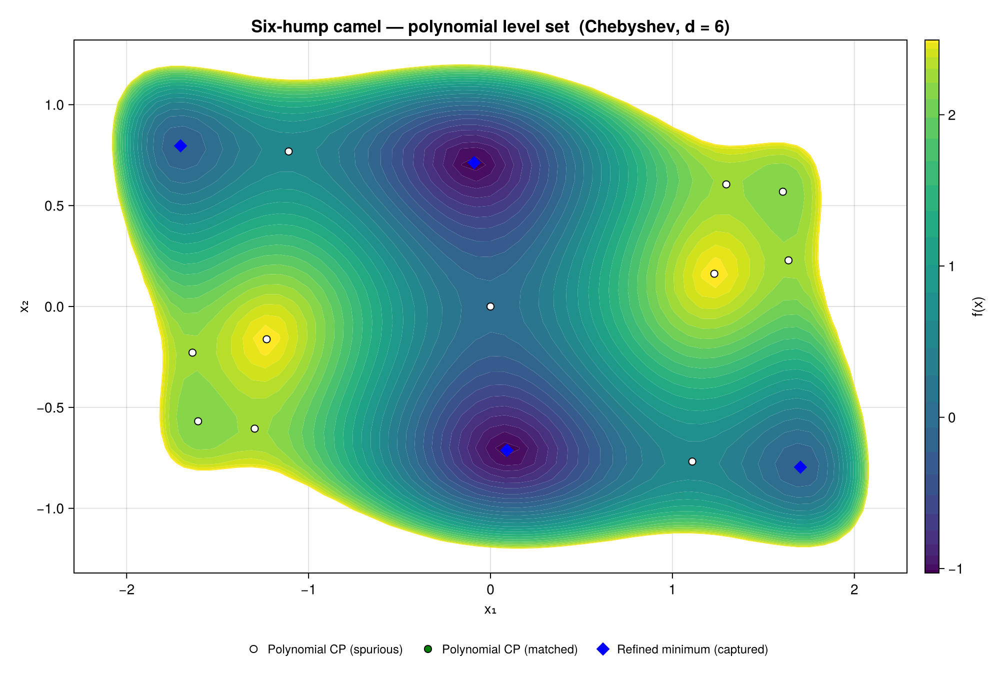
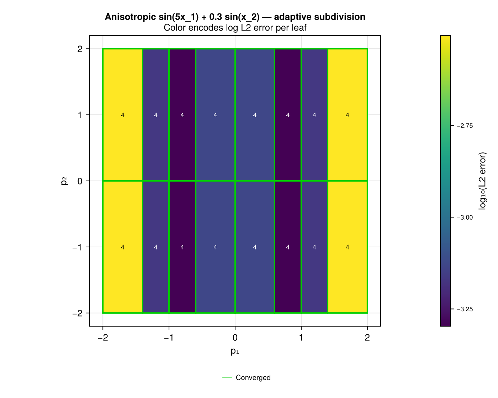
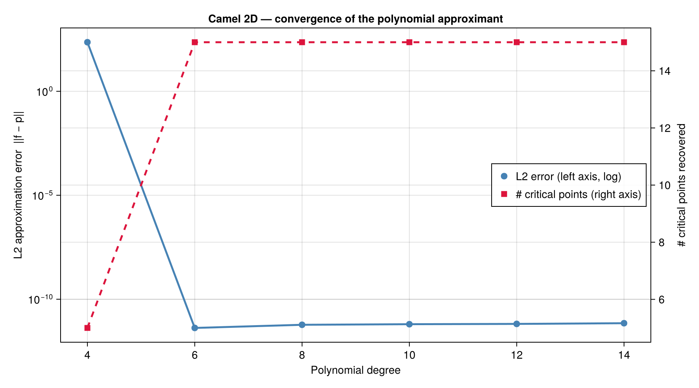

# API Reference

```@meta
CurrentModule = GlobtimPlots
```

GlobtimPlots is organized by what you want to draw:

- **Level sets** — polynomial approximation contours with critical points overlaid
  (`cairo_plot_polyapprox_levelset`, `plot_polyapprox_levelset`).
- **Convergence & statistics** — how approximation quality and recovered critical-point
  counts move with degree (`plot_convergence_analysis`, `plot_discrete_l2`).
- **Eigenvalue / Morse spectra** — Hessian eigenvalues per critical point, colored by
  Morse type (`plot_critical_eigenvalues`, `plot_all_eigenvalues`).
- **Subdivision** — adaptive-partition diagnostics
  (`plot_subdivision_partition`, `plot_subdivision_on_levelset`, `interactive_error_explorer`).
- **1D / 2D approximation** — polynomial-fit-vs-truth plots
  (`plot_1d_polynomial_approximation`, `plot_2d_partition`).

The categorized index below complements the auto-generated docstrings.

## Choosing a backend

GlobtimPlots draws through [Makie](https://docs.makie.org/). You must load a backend
with `using` **before** calling any plot function — the backend-specific methods live
in package extensions that activate on load:

| Backend | Use for | Notes |
|---------|---------|-------|
| `CairoMakie` | Static, publication-quality PNG / PDF / SVG | Powers all `cairo_*` functions and static `plot_*` output |
| `GLMakie` | Interactive 3D windows, animation, `interactive_error_explorer` | Needs a display / GPU; not available headless |
| `WGLMakie` | Browser-embedded / Documenter-rendered interactive plots | Used when embedding interactive figures in these docs |

```julia
using GlobtimPlots
using CairoMakie     # load the backend FIRST
fig = cairo_plot_polyapprox_levelset(apol, ainp, df_cp, df_min)
CairoMakie.save("levelset.png", fig)
```

## Worked examples

These mirror [`pkg/globtimplots/examples/gallery.jl`](https://github.com/gescholt/GlobtimPlots.jl/blob/main/examples/gallery.jl),
the script that regenerates the gallery images. Each assumes you have already built a
Globtim approximation `pol`/`TR` and its critical-point DataFrames `df_cp`/`df_min`
(see the [Home page Quick Start](index.md)).

**Level set with critical points** — `cairo_plot_polyapprox_levelset`:

```julia
apol = adapt_polynomial_data(pol)
ainp = adapt_problem_input(TR)
fig = cairo_plot_polyapprox_levelset(
    apol, ainp, df_cp, df_min;
    chebyshev_levels = true,
    title = "Six-hump camel — polynomial level set (Chebyshev, d = 6)",
    xlabel = "x₁", ylabel = "x₂", colorbar_label = "f(x)",
)
```


**Adaptive subdivision partition** — `plot_subdivision_partition` (build a `tree` with
`adaptive_refine`, then pass per-leaf bounds / L2 errors / degrees):

```julia
fig = plot_subdivision_partition(
    leaf_bounds, leaf_l2, leaf_deg;
    title = "Anisotropic subdivision  (color: log₁₀ L₂ error)",
    l2_tolerance = 0.005,
    style = SubdivisionPartitionStyle(show_degree_labels = false),
)
```


**Degree-sweep convergence** — `plot_convergence_analysis` takes a `results` dictionary
keyed by polynomial degree (each value carrying a `.df` of analyzed critical points)
plus the degree range, and plots how the critical-point spread tightens with degree:

```julia
# results :: Dict{Int} where results[d].df is the analyze_critical_points DataFrame at degree d
fig = plot_convergence_analysis(results, 4, 14, 2)   # start, end, step
```

The gallery's combined L2-error-and-CP-count figure (shown below) is hand-built with
Makie primitives in [`gallery.jl`](https://github.com/gescholt/GlobtimPlots.jl/blob/main/examples/gallery.jl);
adapt it when you want both axes on one plot.



## Core Functions

```@autodocs
Modules = [GlobtimPlots]
```

## CairoMakie Extension

Static plotting functions for publication-quality output.

### Level Set Plots
- `cairo_plot_polyapprox_levelset` - Main level set visualization
- `plot_polyapprox_levelset_2D` - 2D level set variant

### Statistical Analysis
- `plot_convergence_analysis` - Convergence analysis plots  
- `plot_discrete_l2` - L2 norm visualization
- `plot_filtered_y_distances` - Distance analysis
- `plot_distance_statistics` - Statistical distance plots
- `plot_convergence_captured` - Captured point analysis

### Eigenvalue Analysis
- `plot_hessian_norms` - Hessian visualization
- `plot_condition_numbers` - Condition number plots
- `plot_critical_eigenvalues` - Eigenvalue analysis
- `plot_all_eigenvalues` - Complete eigenvalue spectrum
- `plot_raw_vs_refined_eigenvalues` - Refinement comparison

## GLMakie Extension

Interactive and 3D plotting functions.

### 3D Visualization
- `plot_polyapprox_3d` - 3D surface visualization
- `plot_polyapprox_levelset` - Interactive level sets
- `plot_level_set` - Core level set plotting

### Animation
- `plot_polyapprox_rotate` - Rotation animations
- `plot_polyapprox_animate` - Animation sequences  
- `plot_polyapprox_flyover` - Flyover animations
- `plot_polyapprox_animate2` - Advanced animations

### Error Visualization
- `plot_error_function_1D_with_critical_points` - 1D error visualization
- `plot_error_function_2D_with_critical_points` - 2D error visualization

## Subdivision Visualization

Functions for visualizing adaptive subdivision experiments.

### Domain Partition
- `plot_subdivision_partition` - 2D domain partition with convergence coloring, CPs, and degree labels
- `SubdivisionPartitionStyle` - Style configuration for partition plots

### Level Set Overlay
- `plot_subdivision_on_levelset` - Objective function contours with subdivision boundaries and CPs overlaid (tree-based; runtime only)
- `plot_subdivision_on_levelset_from_bounds` - Same plot built from serialized leaf bounds + L2 errors (works from JSON results, no tree needed)

### Error Heatmap
- `plot_subdivision_error_heatmap` - Per-cell polynomial approximation error on a fine grid
- `compute_error_grid` - Build error grid from tree and objective function
- `find_containing_leaf` - Look up which leaf contains a query point

### Interactive Error Explorer
- `interactive_error_explorer` - GLMakie zoom-refine explorer with reset and log/linear toggle

### Utilities
- `format_degree_label` - Format polynomial degree for display
- `effective_degree` - Compute effective degree from leaf data
- `min_degree` - Minimum degree across leaves

## Subdivision Tree

- `plot_subdivision_tree` - Tree structure visualization
- `TreeVizStyle` - Style configuration
- `print_tree_summary` - Terminal summary

## 1D Polynomial Approximation

- `plot_1d_polynomial_approximation` - Plot 1D polynomial fit vs true function
- `plot_1d_comparison` - Compare multiple 1D fits

## 2D Partition (AMR)

- `plot_2d_partition` - 2D AMR-style partition visualization
- `plot_l2_trajectories` - L2 error trajectory plots
- `PartitionStyle` - Style configuration

## Capture Analysis

- `plot_capture_convergence` - Convergence of captured critical points
- `plot_capture_sparsification_combined` - Combined capture/sparsification plot

## Refinement Trajectories

- `plot_refinement_trajectories!` - Overlay refinement paths on existing axes
- `RefinementTrajectoryStyle` - Style configuration

## LV4D Plots

Lotka-Volterra 4D convergence and comparison plots.

```@autodocs
Modules = [GlobtimPlots.LV4DPlots]
```