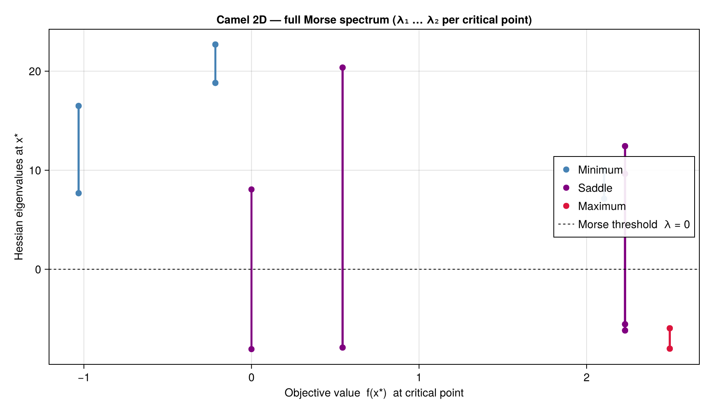

# GlobtimPlots.jl

A Julia package for advanced plotting and visualization of global optimization algorithms and polynomial approximations.

## Overview

GlobtimPlots.jl provides a comprehensive suite of plotting functions for:

- **Level Set Visualization**: Interactive and static level set plots
- **3D Surface Plots**: Advanced 3D surface visualization with rotation and animation
- **Convergence Analysis**: Statistical analysis and visualization of algorithm convergence
- **Eigenvalue Analysis**: Specialized plots for Hessian eigenvalues and condition numbers
- **Error Function Visualization**: 1D and 2D error function plots with critical points

## Gallery

Sample outputs regenerated by `examples/gallery.jl`:

**Polynomial approximation level set** — `cairo_plot_polyapprox_levelset` on the Camel function:


**Adaptive subdivision partition** — `plot_subdivision_partition` on an anisotropic test function (high frequency in x_1, low frequency in x_2). The algorithm subdivides only along x_1; color encodes log10 L2 error per leaf:


**Convergence vs polynomial degree** — Camel degree sweep with L2 approximation error (log, left axis) and number of recovered critical points (right axis). Both pivot dramatically between degree 4 and degree 6:


**Morse spectrum at each critical point** — Hessian eigenvalues as a vertical segment from λ₁ to λ₂, colored by Morse classification. Minima above y=0 (positive definite), maxima below (negative definite), saddles cross the Morse threshold:



## Features

### Static Plotting (CairoMakie Backend)
- High-quality publication-ready plots
- Level set visualization
- Convergence analysis plots
- Statistical distribution plots
- Eigenvalue spectrum analysis

### Interactive Plotting (GLMakie Backend)  
- Real-time 3D surface visualization
- Interactive level sets
- Animation sequences
- Camera flyover animations
- Real-time algorithm tracking

## Installation

GlobtimPlots is not yet registered in the General registry; install it (and a Makie
backend) from its public repository:

```julia
using Pkg
Pkg.add(url="https://github.com/gescholt/GlobtimPlots.jl")
Pkg.add("CairoMakie")   # static backend; or GLMakie for interactive windows
```

## Quick Start

Load a Makie backend (`CairoMakie` for static files, `GLMakie` for interactive
windows) **before** any plot call, then render a polynomial level set with its
critical points:

```julia
using Globtim, GlobtimPlots
using CairoMakie
using DynamicPolynomials: @polyvar
using HomotopyContinuation   # enables the :hc critical-point solver

# 1. Approximate a test function and solve for its critical points (Globtim)
TR  = TestInput(camel; dim=2, center=[0.0, 0.0], GN=200, sample_range=5.0)
pol = Constructor(TR, 6, basis=:chebyshev, precision=RationalPrecision)
@polyvar x[1:2]
df_cp = process_crit_pts(solve_polynomial_system(x, pol), camel, TR)
df_cp, df_min = analyze_critical_points(camel, df_cp, TR; tol_dist=0.00125)

# 2. Plot the level set with critical points overlaid (GlobtimPlots)
apol = adapt_polynomial_data(pol)
ainp = adapt_problem_input(TR)
fig  = cairo_plot_polyapprox_levelset(apol, ainp, df_cp, df_min; title="Six-hump camel")
CairoMakie.save("camel_levelset.png", fig)
```

This is the recipe used to generate the gallery image above; the full version with
the Morse spectrum, subdivision partition, and convergence sweep lives in
[`pkg/globtimplots/examples/gallery.jl`](https://github.com/gescholt/GlobtimPlots.jl/blob/main/examples/gallery.jl).

## Migration from Globtim

This package extracts plotting functionality from the main Globtim package to provide:
- Cleaner separation of concerns  
- Reduced dependencies in core optimization code
- Extensible plotting system
- Better maintainability

See the [Migration Guide](migration.md) for detailed migration instructions.